# 图解的Word2vec

讨论： [Hacker News（347分，37条评论）](https://news.ycombinator.com/item?id=19498356)，[Reddit r / MachineLearning（151分，19条评论）](https://www.reddit.com/r/MachineLearning/comments/b60jtg/p_the_illustrated_word2vec/)
翻译：[中文（简体）](https://mp.weixin.qq.com/s?__biz=MjM5MTQzNzU2NA==&mid=2651669277&idx=2&sn=bc8f0590f9e340c1f1359982726c5a30&chksm=bd4c648e8a3bed9817f30c5a512e79fe0cc6fbc58544f97c857c30b120e76508fef37cae49bc&scene=0&xtrack=1#rd)，[韩文](https://databreak.netlify.com/2019-04-25-illustrated_word2vec/)，[葡萄牙语](https://pessoalex.wordpress.com/2019/03/29/o-word2vec-ilustrado/)，[俄语](https://habr.com/ru/post/446530/)

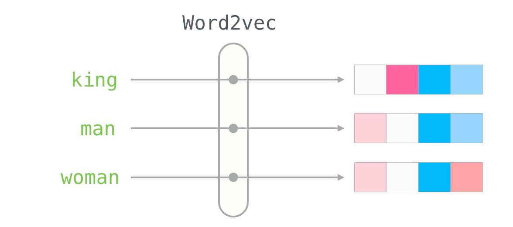

> “ **万物都有一种模式，是我们宇宙的一部分。它具有对称性，优雅性和优雅性** -那些真正的艺术家所捕捉到的品质总是可以找到的。您可以在季节变化中，沿着沙丘沿山脊行进的方式，在杂酚丛的树枝丛中或树叶的图案中找到它。
>
> 我们尝试在生活和社会中复制这些模式，以寻求节奏，舞蹈和舒适的形式。然而，有可能发现最终完美的危险。显然，最终模式包含其自身的固定性。在这样的完美中，万物都走向死亡。”〜Dune（1965）

我发现嵌入的概念是机器学习中最引人入胜的想法之一。如果您曾经将Siri，Google Assistant，Alexa，Google Translate甚至是智能手机键盘用于下一个单词的预测，那么您可能会从已经成为自然语言处理模型的核心的这一想法中受益。在过去的几十年中，在神经模型中使用嵌入有了很大的发展（最近的发展包括上下文化的词嵌入，导致了诸如[BERT](https://jalammar.github.io/illustrated-bert/)和GPT2之类的尖端模型）。

Word2vec是一种有效地创建单词嵌入的方法，自2013年以来一直存在。但是，除了它作为单词嵌入方法的效用之外，它的某些概念还被证明可以有效地创建推荐引擎并理解顺序数据，甚至在商业，非语言任务中。像[Airbnb](https://www.kdd.org/kdd2018/accepted-papers/view/real-time-personalization-using-embeddings-for-search-ranking-at-airbnb)，[阿里巴巴](https://www.kdd.org/kdd2018/accepted-papers/view/billion-scale-commodity-embedding-for-e-commerce-recommendation-in-alibaba)，[Spotify](https://www.slideshare.net/AndySloane/machine-learning-spotify-madison-big-data-meetup)和[Anghami](https://towardsdatascience.com/using-word2vec-for-music-recommendations-bb9649ac2484)这样的公司都从NLP领域中雕刻出了这台出色的机器并将其用于生产中，从而为新一代的推荐引擎提供了帮助。

在本文中，我们将介绍嵌入的概念以及使用word2vec生成嵌入的机制。但是，让我们从一个示例开始，以熟悉使用向量表示事物的过程。您是否知道五个数字（一个向量）可以代表您的个性？

## 个性嵌入：你喜欢什么？

> “我给你沙漠变色龙，它的融合能力可以告诉你所有有关生态学根源和个人身份基础的知识”〜沙丘之子

在0到100的范围内，您内向/外向度如何（其中0是内向度最高，而100是内向度最高）？您是否曾经参加过MBTI之类的性格测验，甚至更好地参加过[“五种人格特质”](https://en.wikipedia.org/wiki/Big_Five_personality_traits)测验？如果您还没有，这些测试会询问您一系列问题，然后在多个轴上给您打分，其中内向/外向就是其中之一。


大五人格特质测试结果的示例。它确实可以告诉您很多有关您自己的信息，并显示出对[学术](http://psychology.okstate.edu/faculty/jgrice/psyc4333/FiveFactor_GPAPaper.pdf)，[个人](https://onlinelibrary.wiley.com/doi/abs/10.1111/j.1744-6570.1999.tb00174.x)和[专业成功的](https://www.massgeneral.org/psychiatry/assets/published_papers/soldz-1999.pdf)预测能力。[这](https://projects.fivethirtyeight.com/personality-quiz/)是查找结果的地方。

想象一下，我的内向/外向得分为38/100。我们可以这样绘制：


让我们将范围从-1切换为1：

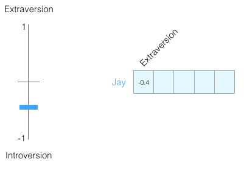

您感觉自己认识的人只知道这一项有关他们的信息的程度如何？不多。人很复杂。因此，让我们添加另一个维度–测试中另一个特征的得分。


我们可以将二维表示为图形上的一个点，或者更好地表示为从原点到该点的向量。我们拥有令人难以置信的工具来处理很快就会派上用场的向量。

我已经隐藏了我们要绘制的特征，以使您习惯于不知道每个维度代表什么，但仍然可以从一个人的性格的向量代表中获得很多价值。

现在我们可以说这个向量部分地代表了我的个性。当您想将另外两个人与我进行比较时，这种表示法很有用。假设我被a打中了，`bus`而我需要被具有相似性格的人替换。在下图中，两个人中的哪个人与我更相似？


处理向量时，计算相似性得分的一种常见方法是[cosine_similarity](https://en.wikipedia.org/wiki/Cosine_similarity)：


1号人物的性格与我更相似。指向相同方向（长度也起作用）的向量具有较高的余弦相似度得分。

再者，两个维度还不足以捕获有关不同人的足够信息。几十年来的心理学研究导致了五个主要特征（以及许多次要特征）。因此，让我们在比较中使用所有五个维度：


五个维度的问题在于，我们失去了在二维中绘制整洁的小箭头的能力。这是机器学习中的一个常见挑战，我们经常不得不在更高维度的空间中进行思考。好处是，尽管cosine_similarity仍然有效。它适用于任意数量的尺寸：


余弦相似度适用于任意数量的维度。这些分数要好得多，因为它们是基于对所比较事物的高分辨率表示来计算的。

在本节的最后，我希望我们提出两个中心思想：

1. 我们可以将人（和事物）表示为数字的向量（这对机器非常有用！）。
2. 我们可以轻松地计算出彼此相似的向量。

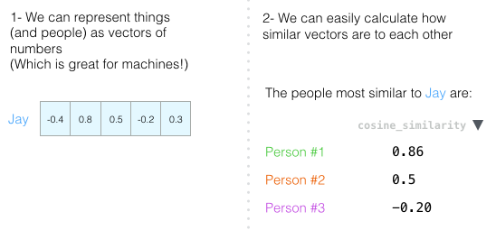

## 词嵌入

> “言语的礼物就是欺骗和幻想的礼物”〜沙丘的孩子

有了这种理解，我们就可以着眼于训练有素的词向量示例（也称为词嵌入），并开始研究它们的一些有趣特性。

这是嵌入“国王”一词的单词（在Wikipedia上训练的GloVe矢量）：

```
[ 0.50451 , 0.68607 , -0.59517 , -0.022801, 0.60046 , -0.13498 , -0.08813 , 0.47377 , -0.61798 , -0.31012 , -0.076666, 1.493 , -0.034189, -0.98173 , 0.68229 , 0.81722 , -0.51874 , -0.31503 , -0.55809 , 0.66421 , 0.1961 , -0.13495 , -0.11476 , -0.30344 , 0.41177 , -2.223 , -1.0756 , -1.0783 , -0.34354 , 0.33505 , 1.9927 , -0.04234 , -0.64319 , 0.71125 , 0.49159 , 0.16754 , 0.34344 , -0.25663 , -0.8523 , 0.1661 , 0.40102 , 1.1685 , -1.0137 , -0.21585 , -0.15155 , 0.78321 , -0.91241 , -1.6106 , -0.64426 , -0.51042 ]
```

它是50个数字的列表。通过观察这些值我们不能说太多。但是让我们对其进行可视化，以便我们可以将其与其他单词向量进行比较。让我们将所有这些数字放在一行中：


让我们根据它们的值对单元格进行颜色编码（如果它们接近2，则为红色；如果接近0，则为白色；如果接近-2，则为蓝色）：


我们将忽略数字，仅查看颜色以指示单元格的值。现在让我们将“国王”与其他词语进行对比：


看到“男人”和“女人”之间的相似之处远比“国王”中的任何一个相似吗？这告诉你一些事情。这些向量表示捕获了这些单词的相当一部分信息/含义/关联。

这是另一个示例列表（通过垂直扫描列以查找具有相似颜色的列进行比较）：


需要指出的几点：

1. 所有这些不同的词都有一个直的红色栏。它们在那个维度上是相似的（而且我们不知道每个维度代表什么）
2. 您可以看到“女人”和“女孩”在很多地方是如何相似的。与“男人”和“男孩”相同
3. “男孩”和“女孩”也有彼此相似的地方，但不同于“女人”或“男人”。这些可以编码为模糊的青年观念吗？可能。
4. 除最后一个词外，所有其他词都是代表人的词。我添加了一个对象（水）以显示类别之间的差异。例如，您可以看到蓝色的列一直向下，并在嵌入“水”之前停止。
5. 在明显的地方，“国王”和“女王”彼此相似，而彼此之间却截然不同。这些难道会成为含糊的版税概念的编码吗？

### 类比

> “言语可以承担我们希望的任何负担。所需要的只是达成协议和建立的传统。” 〜沙丘神皇

类比的概念是显示嵌入令人难以置信的特性的著名示例。我们可以添加和减去单词嵌入，然后得出有趣的结果。最著名的例子是公式：“国王”-“男人” +“女人”：

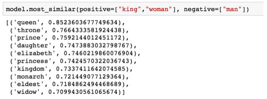
使用python中的[Gensim](https://radimrehurek.com/gensim/)库，我们可以添加和减去单词向量，它将找到与所得向量最相似的单词。该图像显示了最相似的单词的列表，每个单词都有其余弦相似度。

我们可以像以前一样可视化此类比：


“国王男人+女人”产生的向量不完全等于“女王”，但是“女王”是我们在该集合中拥有的40万个词嵌入中与它最接近的词。

现在，我们已经研究了训练有素的词嵌入，让我们进一步了解训练过程。但是在进入word2vec之前，我们需要看一下词嵌入的概念母体：神经语言模型。

## 语言建模

> “先知并没有被过去，现在和未来的幻想所转移。**语言的固定性决定了这种线性差异。**先知用一种语言持有一把锁的钥匙。
>
> 这不是机械世界。事件的线性进程是由观察者施加的。因果？根本不是。**先知说出了致命的话。**您瞥见一件事“注定要发生”。但是预言的瞬间释放了无限的力量和力量。宇宙发生了幽灵般的转变。”〜沙丘天皇

如果要举一个NLP应用程序的例子，最好的例子之一就是智能手机键盘的下一词预测功能。这是数十亿人每天使用数百次的功能。


下一个单词的预测是可以由*语言模型*解决的任务。语言模型可以获取一个单词列表（假设两个单词），并尝试预测紧随其后的单词。

在上面的屏幕截图中，我们可以认为该模型是一个采用了这两个绿色单词（`thou shalt`）并返回了建议列表的模型（“ not”是概率最高的那个）：


我们可以认为模型看起来像这个黑匣子：


但是实际上，该模型不会只输出一个单词。实际上，它会为它所知道的所有单词输出概率得分（模型的“词汇”，范围从几千到一百万个单词不等）。然后，键盘应用程序必须找到得分最高的单词，并将其呈现给用户。


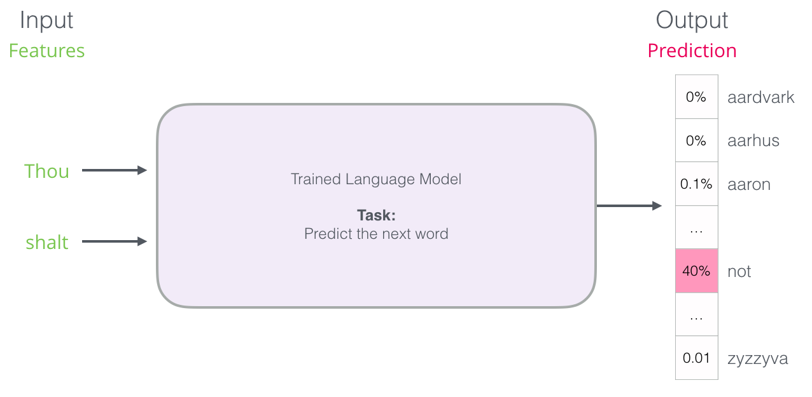
神经语言模型的输出是该模型知道的所有单词的概率得分。我们在这里用百分比表示概率，但是实际上40％在输出向量中表示为0.4。


经过训练后，早期的神经语言模型（[Bengio 2003](http://www.jmlr.org/papers/volume3/bengio03a/bengio03a.pdf)）将通过三个步骤来计算预测：


讨论嵌入时，第一步对我们而言最相关。训练过程的结果之一是该矩阵，其中包含我们词汇表中每个单词的嵌入。在预测期间，我们只查找输入单词的嵌入，然后使用它们来计算预测：

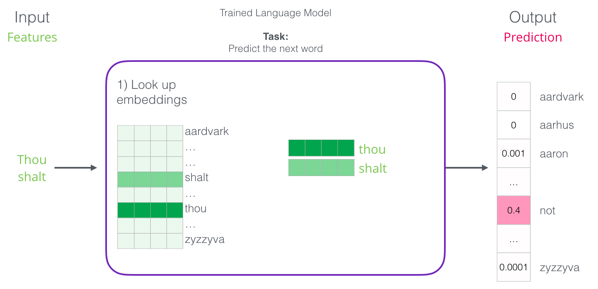

现在让我们转向训练过程，以了解更多有关如何开发此嵌入矩阵的信息。

## 语言模型训练

> “无法通过停止进程来理解它。理解必须随着流程的流逝而移动，必须加入并随其而流。”〜杜恩

与大多数其他机器学习模型相比，语言模型具有巨大的优势。这样做的好处是，我们能够对正在运行的文本进行培训-我们拥有大量的文本。考虑一下我们所拥有的所有书籍，文章，Wikipedia内容和其他形式的文本数据。与许多其他需要手工制作的功能和专门收集的数据的机器学习模型进行对比。

> “您将知道它所拥有的公司的一句话” JR Firth

单词是由我们查看它们倾向于在旁边出现的其他单词的嵌入。其机理是

1. 我们获得了大量文本数据（例如，所有Wikipedia文章）。然后
2. 我们有一个窗口（例如，三个单词），可以在所有文本上滑动。
3. 滑动窗口为我们的模型生成训练样本


当此窗口在文本上滑动时，我们（实际上）生成了用于训练模型的数据集。为了确切地看一下它是如何完成的，让我们看一下滑动窗口如何处理这个短语：

> “你不应该像人类的思想一样制造机器”〜杜恩

当我们开始时，窗口位于句子的前三个单词上：


我们将前两个词作为特征，并将第三个词作为标签：


现在，我们在数据集中生成了第一个样本，以后可以用来训练语言模型。


然后，我们将窗口滑动到下一个位置，并创建另一个示例：


现在生成第二个示例。


很快，我们有了一个更大的数据集，其中的单词倾向于出现在不同的单词对之后：


实际上，当我们滑动窗口时，往往会训练模型。但是我发现从逻辑上将“数据集生成”阶段与训练阶段分离开来更为清晰。除了基于神经网络的语言建模方法外，一种称为N-grams的技术通常用于训练语言模型（请参阅：《[语音和语言处理》的](http://web.stanford.edu/~jurafsky/slp3/)第3章）。若要查看从N-grams转换为神经模型如何反映现实产品，[这是](https://blog.swiftkey.com/neural-networks-a-meaningful-leap-for-mobile-typing/)我最喜欢的Android键盘[Swiftkey在2015年的博客文章](https://blog.swiftkey.com/neural-networks-a-meaningful-leap-for-mobile-typing/)，介绍了他们的神经语言模型并将其与以前的N-gram模型进行比较。我喜欢这个示例，因为它向您展示了如何在营销演讲中描述嵌入的算法特性。

### 两边看

> “悖论是告诉你要超越它的指针。如果悖论困扰着你，那就背叛了你对绝对的深切渴望。相对主义者把悖论仅仅当作是有趣的，也许是有趣的，甚至是可怕的思想，是教育性的。” 〜沙丘神皇

要知道您从帖子的前面知道什么，请填写空白：


我在这里为您提供的上下文是空白单词之前的五个单词（以及前面提到的“公共汽车”）。我相信大多数人都会猜到这个词`bus`会变成空白。但是，如果我再给您提供一条信息（在空格后一个字），那会改变您的答案吗？


这完全改变了空白。这个词`red`现在最有可能成为空白。我们从中学到的是在特定单词之前和之后的单词都具有信息价值。事实证明，考虑两个方向（我们正在猜测的单词左右两个单词）会导致更好的单词嵌入。让我们看看我们如何调整训练模型的方式来解决这个问题。

## 跳过图

> “在一个不仅有可能而且有必要犯错误的领域中，智能会为有限的数据提供机会。”〜第几章：沙丘

我们不仅可以在目标单词之前查看两个单词，还可以在目标单词之后查看两个单词。


如果这样做，我们实际上要构建和训练模型的数据集将如下所示：


这被称为**单词连续袋（Continuous Bag of Words）**架构，并且[在word2vec论文之一](https://arxiv.org/pdf/1301.3781.pdf) [pdf]中进行了描述。另一种倾向于显示出色结果的体系结构在做事上也有所不同。

与其根据上下文（一个单词之前和之后的单词）来猜测一个单词，而是另一种体系结构尝试使用当前单词来猜测相邻的单词。我们可以认为它在培训文本上滑动的窗口看起来像这样：


绿色插槽中的单词将是输入单词，每个粉红色框将是一个可能的输出。

粉色框具有不同的阴影，因为此滑动窗口实际上在我们的训练数据集中创建了四个单独的样本：


此方法称为**跳过图**体系结构。我们可以通过执行以下操作来可视化滑动窗口：


这会将这四个样本添加到我们的训练数据集中：


然后，我们将窗口滑动到下一个位置：


生成下面的四个示例：


几个职位以后，我们有很多例子：


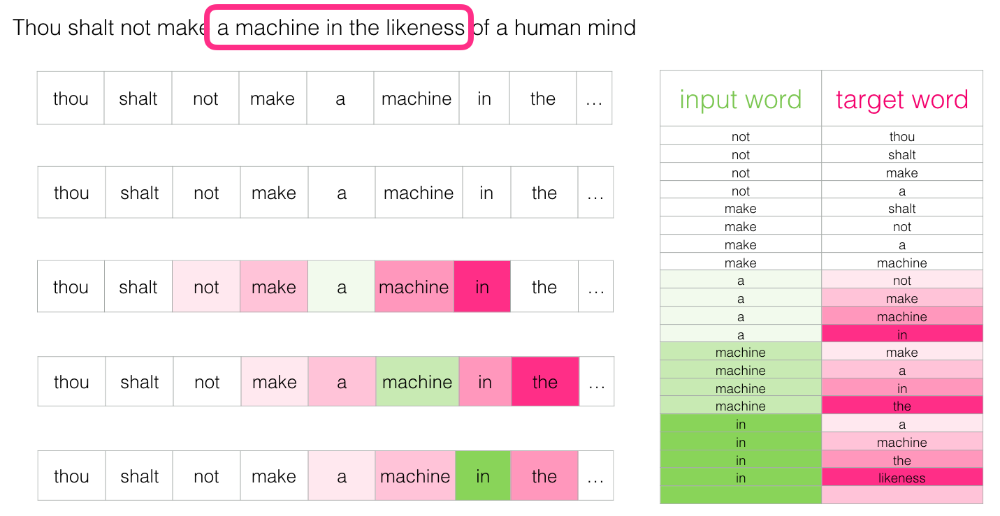

### 回顾培训过程

> “穆迪迪布之所以迅速学习，是因为他的第一门训练是学习方法。而第一课就是他可以学习的基本信任。令人惊讶的是，有多少人不相信自己可以学习，还有多少人相信学习变得困难。” 〜沙丘

现在我们有了从现有运行文本中提取的Skipgram训练数据集，让我们来看看如何使用它来训练预测相邻单词的基本神经语言模型。


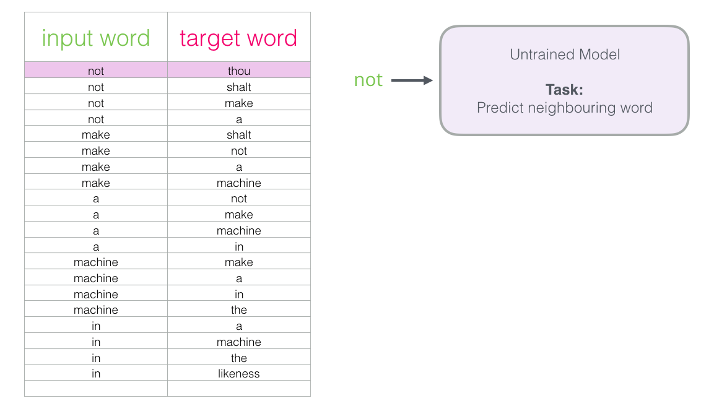

我们从数据集中的第一个样本开始。我们获取特征并馈入未经训练的模型，要求其预测合适的邻近词。


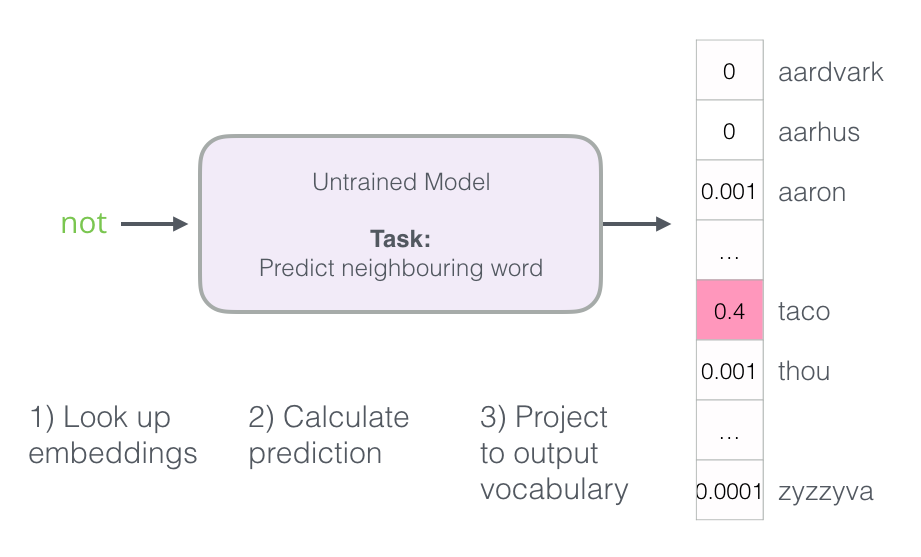

该模型执行这三个步骤，并输出预测向量（将概率分配给词汇中的每个词）。由于模型未经训练，因此在此阶段的预测肯定是错误的。但这没关系。我们知道它应该猜出什么单词–我们当前用于训练模型的行中的标签/输出单元格：


“目标向量”是目标单词的概率为1的单词，所有其他单词的概率为0的单词。


模型距离多远？我们减去两个向量，得出误差向量：


现在，可以使用此误差向量来更新模型，因此在下一次，它更有可能猜测`thou`何时将其`not`作为输入。


培训的第一步到此结束。我们继续对数据集中的下一个样本进行同样的处理，然后对下一个样本进行同样的处理，直到覆盖了数据集中的所有样本。培训结束了一个*纪元*。我们将其重复进行很多次，然后得到训练有素的模型，我们可以从中提取嵌入矩阵并将其用于其他任何应用程序。

尽管这扩展了我们对过程的理解，但仍然不是实际训练word2vec的方式。我们缺少几个关键思想。

## 负采样

> “要想了解Muad'Dib而不了解他的致命敌人Harkonnens，就是要在不了解虚假的情况下尝试了解真相。这是在不知道黑暗的情况下看到光的尝试。不可能。”〜沙丘

回忆一下该神经语言模型如何计算其预测的三个步骤：

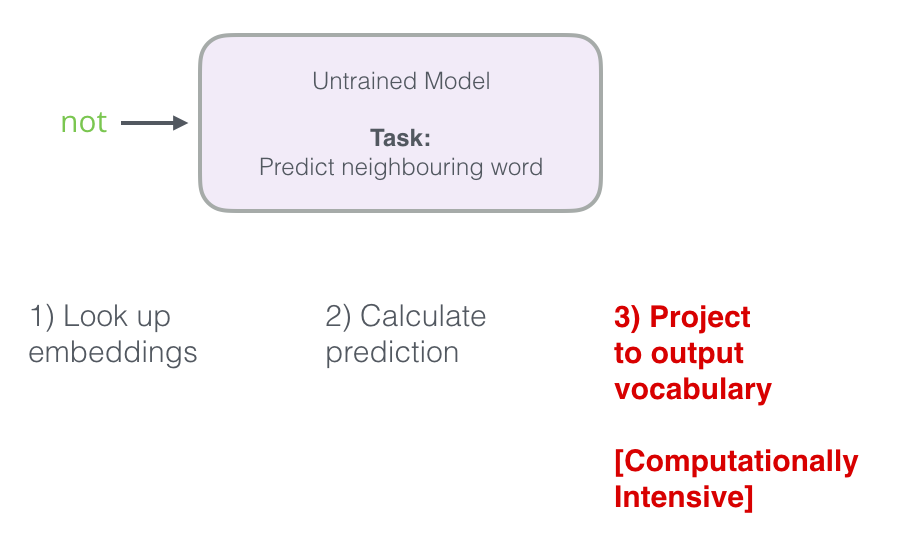


从计算的角度来看，第三步非常昂贵–特别是要知道我们将对数据集中的每个训练样本执行一次（很容易几千万次）。我们需要做一些改善性能的事情。

一种方法是将目标分为两个步骤：

1. 生成高质量的单词嵌入（不必担心下一个单词的预测）。
2. 使用这些高质量的嵌入来训练语言模型（进行下一个单词的预测）。

在本文中，我们将重点放在步骤1。为了使用高性能模型生成高质量的嵌入，我们可以从预测相邻单词切换模型的任务：


并将其切换到采用输入和输出词的模型，并输出一个分数，以指示它们是否为邻居（0表示“非邻居”，1表示“邻居”）。


这个简单的开关将我们需要的模型从神经网络更改为逻辑回归模型-因此它变得更简单，计算更快。

此切换要求我们切换数据集的结构-标签现在是值为0或1的新列。由于添加的所有单词都是邻居，因此它们均为1。


现在可以以惊人的速度进行计算-在几分钟内处理数百万个示例。但是，我们需要解决一个漏洞。如果我们所有的示例都是肯定的（目标：1），那么我们就可以接受始终返回1的smartass模型的可能性-达到100％的准确度，但一无所获并生成垃圾嵌入。

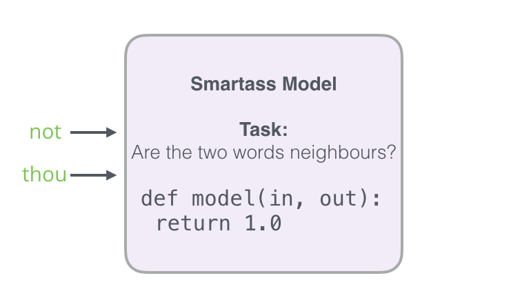

为了解决这个问题，我们需要向数据集中引入*否定样本* -不是邻居的单词样本。对于这些样本，我们的模型需要返回0。现在这是模型必须努力解决的挑战，但仍要以惊人的速度进行。


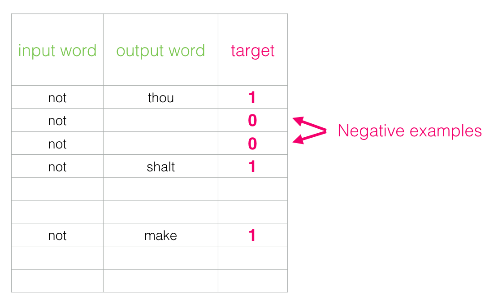
对于数据集中的每个样本，我们添加**否定示例**。它们具有相同的输入词和0标签。

但是，我们要用什么作为输出词呢？我们从词汇表中随机抽取单词


这个想法是受[噪声对比估计](http://proceedings.mlr.press/v9/gutmann10a/gutmann10a.pdf) [pdf] 启发的。我们正在将实际信号（相邻单词的正例）与噪声（不是邻居的随机选择单词）进行对比。这导致在计算和统计效率上进行很大的权衡。

## 负采样跳过图（SGNS）

现在，我们已经介绍了word2vec中的两个中心思想：一对，它们被称为带有负采样的skipgram。


## Word2vec培训过程

> “机器无法预见到对人类重要的每一个问题。这是串行位和连续的连续体之间的区别。我们拥有一台；机器仅限于另一台。” 〜沙丘神皇

现在，我们已经建立了跳过和否定采样这两个中心思想，我们可以继续仔细研究实际的word2vec训练过程。

在训练过程开始之前，我们会对要对其进行训练的文本进行预处理。在这一步中，我们确定词汇量（我们称其`vocab_size`为10,000），以及属于哪个单词。

在训练阶段的开始，我们创建两个矩阵–一个`Embedding`矩阵和一个`Context`矩阵。这两个矩阵对于我们词汇表中的每个单词都有一个嵌入（因此`vocab_size`也是它们的维度之一）。第二个维度是我们希望每个嵌入的时长（`embedding_size`– 300是一个公共值，但我们在本文前面已经看过50的示例）。


在训练过程开始时，我们使用随机值初始化这些矩阵。然后我们开始训练过程。在每个培训步骤中，我们都采用一个积极的榜样及其相关的负面榜样。让我们来看第一组：


现在我们有四个单词：输入单词`not`和输出/上下文单词：（`thou`实际邻居）`aaron`，和`taco`（否定示例）。我们继续查找它们的嵌入-对于输入单词，我们在`Embedding`矩阵中查找。对于上下文单词，我们查看`Context`矩阵（即使两个矩阵都对词汇表中的每个单词都有嵌入）。


然后，我们将输入嵌入的点积与每个上下文嵌入相乘。在每种情况下，这都会产生一个数字，该数字表示输入和上下文嵌入的相似性


现在，我们需要一种将这些分数转换为看起来像概率的方法的方法–我们需要它们都为正数，并且值在零到一之间。对于[S型](https://jalammar.github.io/feedforward-neural-networks-visual-interactive/#sigmoid-visualization)[物流来说](https://en.wikipedia.org/wiki/Logistic_function)，这是一项艰巨的任务。


现在，对于这些示例，我们可以将S型操作的输出视为模型的输出。您可以看到，在进行S型操作之前和之后，得分`taco`最高，但得分`aaron`仍然最低。

现在，未经训练的模型已经做出了预测，并且看起来好像我们有一个实际的目标标签可以进行比较，让我们计算模型的预测中有多少错误。为此，我们只需从目标标签中减去S形得分即可。


`error`= `target`-`sigmoid_scores`


这是“机器学习”的“学习”部分。现在，我们可以利用这个错误分数调整的嵌入物`not`，`thou`，`aaron`和`taco`使下一次我们做出这一计算，结果会更接近目标分数。


培训步骤到此结束。我们从中涌现与在这一步骤的话稍微好一点的嵌入（`not`，`thou`，`aaron`和`taco`）。现在，我们进行下一步（下一个阳性样本及其相关的阴性样本），并再次执行相同的过程。


当我们循环遍历整个数据集多次时，嵌入将继续得到改善。然后，我们可以停止训练过程，丢弃`Context`矩阵，并将其`Embeddings`用作下一个任务的预训练嵌入。

## 窗口大小和负样本数

word2vec训练过程中的两个关键超参数是窗口大小和否定样本数。


不同的窗口大小可以更好地完成不同的任务。一个[启发](https://youtu.be/tAxrlAVw-Tk?t=648)是，较小的窗口大小（2-15）导致的嵌入其中两个的嵌入之间的相似度较高的分数表示的话是*可以互换*（注意，反义词经常互换，如果我们只盯着他们周围的文字-例如*好*和*坏*通常出现在相似的环境中）。较大的窗口大小（15-50，甚至更大）会导致嵌入，其中相似性更能指示单词的*相关性*。在实践中，您通常需要提供[注释](https://youtu.be/ao52o9l6KGw?t=287)指导嵌入过程，从而为您的任务带来有用的相似性。Gensim的默认窗口大小为5（除了输入单词本身之外，输入单词之前的两个单词和输入单词之后的两个单词）。


阴性样本的数量是训练过程的另一个因素。原始论文规定5-20为大量阴性样本。它还指出，如果数据集足够大，则2-5似乎足够。Gensim默认值为5个负样本。

## 结论

> “如果它落在了您的准绳之外，那么您就在从事智能而不是自动化”〜沙丘神皇

我希望您现在对词嵌入和word2vec算法有所了解。我还希望现在当您阅读提及“带有负采样的跳过语法”（SGNS）的论文（如顶部的推荐系统论文）时，对这些概念有更好的理解。与往常一样，[@jalammar](https://twitter.com/jalammar)感谢所有反馈。

## 参考资料和进一步阅读

- [单词和短语的分布式表示及其组成](https://papers.nips.cc/paper/5021-distributed-representations-of-words-and-phrases-and-their-compositionality.pdf) [pdf]
- [向量空间中单词表示的有效估计](https://arxiv.org/pdf/1301.3781.pdf) [pdf]
- [神经概率语言模型](http://www.jmlr.org/papers/volume3/bengio03a/bengio03a.pdf) [pdf]
- Dan Jurafsky和James H. Martin的[语音和语言处理](https://web.stanford.edu/~jurafsky/slp3/)是NLP的主要资源。第2章将介绍Word2vec。
- [Yoav Goldberg撰写的《](https://twitter.com/yoavgo)[自然语言处理中](https://www.amazon.com/Language-Processing-Synthesis-Lectures-Technologies/dp/1627052984)的[神经网络方法》](https://www.amazon.com/Language-Processing-Synthesis-Lectures-Technologies/dp/1627052984)对于神经NLP主题非常有用。
- [克里斯·麦考密克（Chris McCormick](http://mccormickml.com/)）写了一些有关Word2vec的精彩博客文章。他还刚刚发布[了word2vec的内部工作原理](https://www.preview.nearist.ai/paid-ebook-and-tutorial)，这是一本针对[word2vec内部原理的](https://www.preview.nearist.ai/paid-ebook-and-tutorial)电子书。
- 想阅读代码吗？这里有两个选择：
  - Gensim的word2vec 的[python实现](https://github.com/RaRe-Technologies/gensim/blob/develop/gensim/models/word2vec.py)
  - Mikolov [在C中](https://github.com/tmikolov/word2vec/blob/master/word2vec.c)的原始[实现](https://github.com/tmikolov/word2vec/blob/master/word2vec.c) –更好的是，此[版本带有](https://github.com/chrisjmccormick/word2vec_commented/blob/master/word2vec.c) Chris McCormick的[详细注释](https://github.com/chrisjmccormick/word2vec_commented/blob/master/word2vec.c)。
- [评估组成语义的分布模型](http://sro.sussex.ac.uk/id/eprint/61062/1/Batchkarov, Miroslav Manov.pdf)
- [关于词嵌入](http://ruder.io/word-embeddings-1/index.html)，[第2部分](http://ruder.io/word-embeddings-softmax/)
- [沙丘](https://www.amazon.com/Dune-Frank-Herbert/dp/0441172717/)